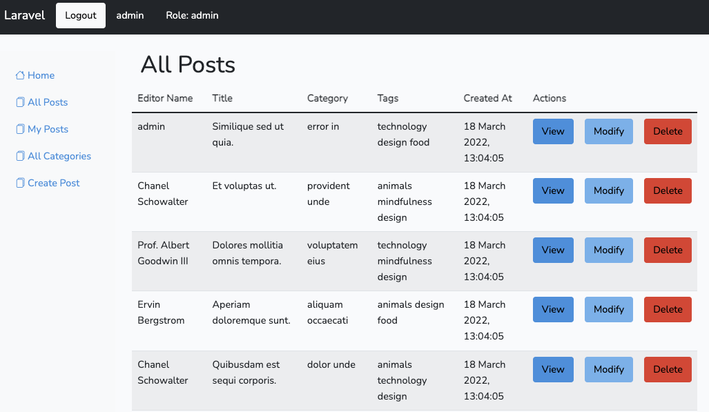

# laravel-boolpress

## Fully functioning creation and managment posts' website (like Wordpress), possibility of multiple authentication and registration, multiple privileges, editable or deletable posts.

## Project setup
```
    composer install
    npm install
    php artisan key:generate
    php artisan storage:link
```
### Duplicate .env.example e rename it in .env (modify only DB information and APP_URL if is needed)
<br>

### Compiles and hot-reloads for development, run in server
```
    npm run watch
    php artisan serve
```
<br>

### If a new db is created (PHPMyAdmin), run
    php artisan migrate
    php artisan db:seed
<br>
<br>

## Access with ADMIN credentials:
    - Mail: admin@admin
    - Password: adadadad

## Access with GUEST credentials:
    - Mail: guest@guest
    - Password: adadadad
<br>

## If role == admin, you see all posts, included yours and you can modify or delete them all
## If role == guest, you see only your posts and you can modify or delete only them
<br>

